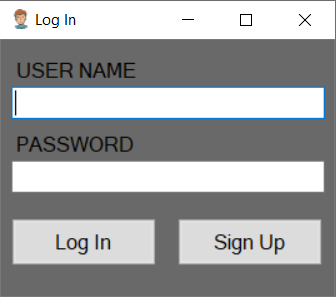
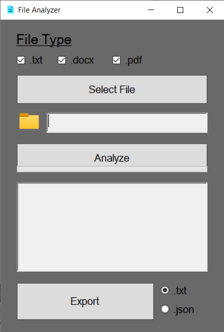

<h1 align="center">File Analyzer</h1>

<p align="center">
A .NET Framework file analysis solution with shared core logic, Console and Windows Forms interfaces, and support for TXT, DOCX, and PDF documents.
</p>

<p align="center">
  
  
  
  
  
  
</p>

---

## Project Overview

**File Analyzer** is a multi-interface desktop solution for reading and analyzing
text-based documents. The project includes both a Console application and a
Windows Forms application, built on top of a shared core library.

The analyzer extracts text from supported file types and reports useful text
statistics such as character count, line count, unique word count, repeated word
frequency, and punctuation frequency.

The project was originally developed as separate Console and WinForms
applications, then reorganized into a single professional solution with shared
business logic.

---

## Supported File Types

| File Type | Support |
|-----------|---------|
| `.txt` | Plain text reading |
| `.docx` | Word document text extraction |
| `.pdf` | PDF text extraction |

---

## Technologies Used

| Technology | Purpose |
|-----------|---------|
| C# | Main programming language |
| .NET Framework 4.8 | Application framework |
| Windows Forms | Desktop graphical interface |
| Console Application | Lightweight command-line style interface |
| Open XML SDK | DOCX text extraction |
| PdfPig | PDF text extraction |
| Newtonsoft.Json | JSON export support in WinForms |
| Visual Studio | Development and build environment |

---

## Solution Architecture

The solution separates shared analysis logic from user interface logic.

```text
FileAnalyzer/
|-- FileAnalyzer.sln
|-- README.md
|-- LICENSE
|-- .gitignore
|-- assets/
|   `-- screenshots/
|       |-- winforms-login.png
|       `-- winforms-analyzer.png
|
`-- src/
    |-- FileAnalyzer.Core/
    |   |-- FileReaders/
    |   |   |-- TxtFileReader.cs
    |   |   |-- DocxFileReader.cs
    |   |   `-- PdfFileReader.cs
    |   |-- Models/
    |   |   `-- AnalysisResult.cs
    |   |-- TextAnalyzer.cs
    |   |-- FileAnalyzer.Core.csproj
    |   `-- packages.config
    |
    |-- FileAnalyzer.Console/
    |   |-- Program.cs
    |   |-- App.config
    |   `-- FileAnalyzer.Console.csproj
    |
    `-- FileAnalyzer.WinForms/
        |-- Form1.cs
        |-- Form2.cs
        |-- Program.cs
        |-- App.config
        |-- Resources/
        |-- Properties/
        |-- FileAnalyzer.WinForms.csproj
        `-- packages.config
```

---

## Main Components

| Component | Responsibility |
|----------|----------------|
| `FileAnalyzer.Core` | Shared file reading and text analysis logic |
| `TextAnalyzer.cs` | Calculates text statistics and formats analysis output |
| `TxtFileReader.cs` | Reads plain text files |
| `DocxFileReader.cs` | Extracts paragraph text from DOCX files |
| `PdfFileReader.cs` | Extracts page text from PDF files |
| `AnalysisResult.cs` | Stores structured analysis results |
| `FileAnalyzer.Console` | Console-based file selection and output flow |
| `FileAnalyzer.WinForms` | Windows Forms UI, filtering, progress bar, login screen, and export flow |

---

## Features

- Analyze `.txt`, `.docx`, and `.pdf` files
- Shared core library used by both applications
- Console interface for quick document analysis
- Windows Forms interface with file type selection filters
- Character count calculation
- Line count calculation
- Unique word count calculation
- Repeated word frequency listing
- Punctuation frequency listing
- TXT and JSON export support in the WinForms application
- Local error logging under `Logs/log.txt`
- Optional login/signup screen in the WinForms application
- Guest mode support without database configuration

---

## Analysis Workflow

```text
Select a file
   |
   v
Detect file extension
   |
   v
Use the matching file reader
   |
   v
Extract text content
   |
   v
Analyze text in FileAnalyzer.Core
   |
   v
Display result in Console or WinForms UI
   |
   v
Optionally export result from WinForms
```

---

## Console Application

The Console application provides a lightweight workflow for choosing a supported
file and printing the analysis result directly to the console window.

### Sample Console Output

<pre style="background-color:#0d1117; color:#f0f6fc; padding:16px; border-radius:6px; overflow:auto;"><code>Character Count: 1248
Line Count: 32
Unique Word Count: 186

Repetitive Words
----------------
5  analyzer
3  document
2  file

Punctuation Counts
------------------
. : 18
, : 9
: : 4</code></pre>

---

## Windows Forms Application

The Windows Forms application provides a graphical interface with selectable file
filters, progress feedback, formatted analysis output, and export options.

### Login and Signup Screen

The login/signup screen is optional. Users can continue with guest mode when no
database connection is configured.



### File Analyzer Screen



---

## Text Analysis Details

The analyzer reports:

| Metric | Description |
|--------|-------------|
| Character Count | Total number of characters in the extracted content |
| Line Count | Total number of lines in the extracted content |
| Unique Word Count | Number of distinct filtered words |
| Repeated Words | Words appearing more than once, sorted by frequency |
| Punctuation Counts | Punctuation marks found in the content, sorted by frequency |

During word analysis, common conjunctions such as `ve`, `ile`, `ama`, and
`ancak` are excluded, and numeric tokens are ignored.

---

## Export Options

The Windows Forms application can export the current analysis result as:

```text
AnalyzeResults/
|-- AnalyzeResult.txt
`-- AnalyzeResult.json
```

Generated export files are ignored by Git because they are runtime outputs.

---

## Login Configuration

The WinForms application can be used as a guest without database setup.

Login and signup are optional and use the `FileAnalyzerLoginDb` connection string
inside:

```text
src/FileAnalyzer.WinForms/App.config
```

To enable the database-backed login flow, configure the connection string and
provide a table named `LogInTable` with `Username` and `Password` columns.

---

## Error Logging

Runtime exceptions are written to:

```text
Logs/log.txt
```

The `Logs/` directory is ignored by Git because it contains local runtime data.

---

## How to Run

Open the solution in Visual Studio:

```text
FileAnalyzer.sln
```

Restore NuGet packages if Visual Studio prompts for it.

### Run the Console App

1. Right-click `FileAnalyzer.Console`.
2. Select **Set as Startup Project**.
3. Run with `F5` or `Ctrl + F5`.
4. Select a supported file from the file dialog.

### Run the Windows Forms App

1. Right-click `FileAnalyzer.WinForms`.
2. Select **Set as Startup Project**.
3. Run with `F5` or `Ctrl + F5`.
4. Continue as guest or configure login support.
5. Select a supported file and click **Analyze**.

---

## Build Verification

The solution was verified with MSBuild after reorganizing the projects:

```text
Build succeeded.
0 Warning(s)
0 Error(s)
```

---

## Limitations and Future Work

- Login/signup currently uses a simple database-backed flow and is optional.
- Passwords are not hashed yet; authentication can be improved for production use.
- The analyzer uses simple token filtering and can be extended with stronger text normalization.
- Unit tests can be added for file readers and text analysis behavior.
- A modern .NET version could be considered in a future migration.

---

## Author

**A. Furkan ÖCEL**

---

## License

This project is licensed under the terms included in the repository's `LICENSE` file.


